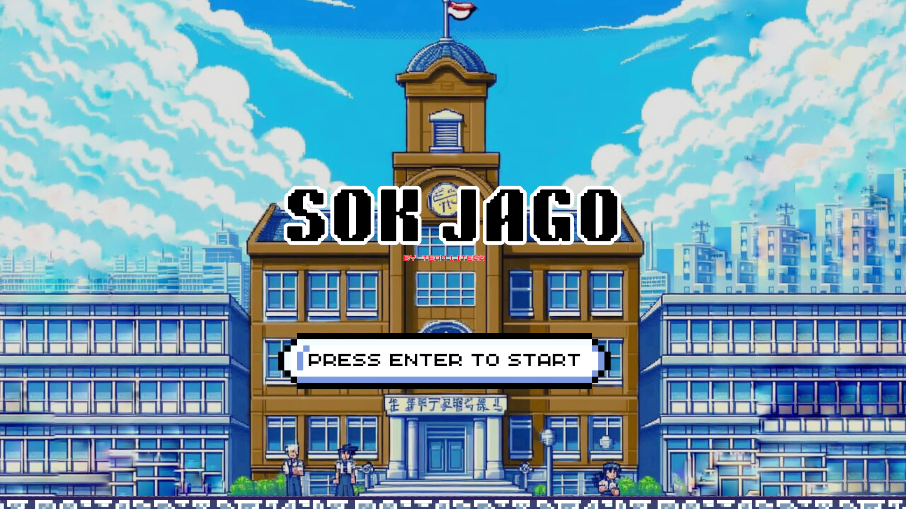
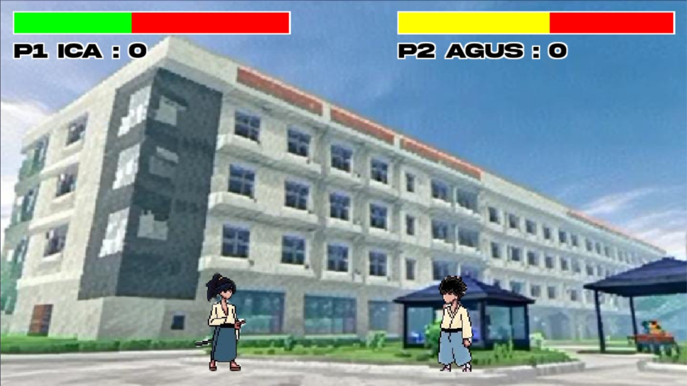
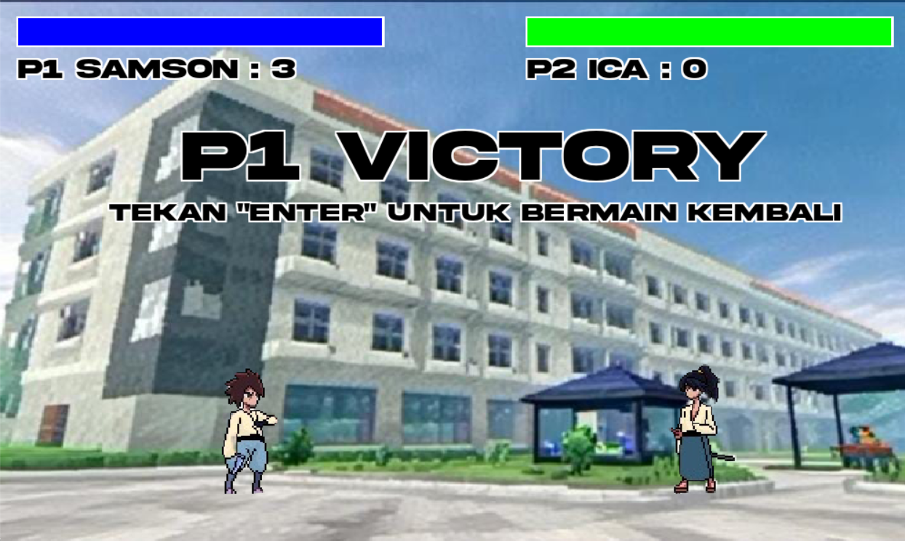

<h1 align="center">Sok Jago</h1>

  

## Project Description
"SOK JAGO" adalah game pertarungan 1 lawan 1 yang terinspirasi oleh game klasik seperti Street Fighter dan Troublemaker. Dengan latar belakang di ITERA, tepatnya di Labtek 3 dan Embung C, pemain akan memilih salah satu dari karakter yang tersedia, masing-masing dengan gaya bertarung dan keterampilan unik. Dalam pertarungan sengit ini, tujuan utama adalah mengalahkan lawan sampai salah satu pemain mencapai tiga poin terlebih dahulu. Dengan mode multiplayer, "SOK JAGO" menawarkan pengalaman yang kompetitif dan seru bagi para pemain yang ingin menguji kemampuan bertarung dan strategi mereka.

## Library, Frameworks & Tools Used

- [Python 3.11](https://www.python.org/)
- [Pygame](https://www.pygame.org/)

<i>Make sure to have Python 3.11 installed on your machine (another version may not work)</i>

## Screenshots

## UML Class Diagram

## Contributors

| Name                     | NIM         | 
|--------------------------|-------------|
| Ferdana Al Hakim         | 122140012   | 
| Nasya Aulia Effendi      | 122140016   | 
| Freddy Harahap           | 122140018   | 
| Zakwan Afif Rizki        | 122140019   | 
| Rifnita Cahyani Hidayat  | 121140031   | 